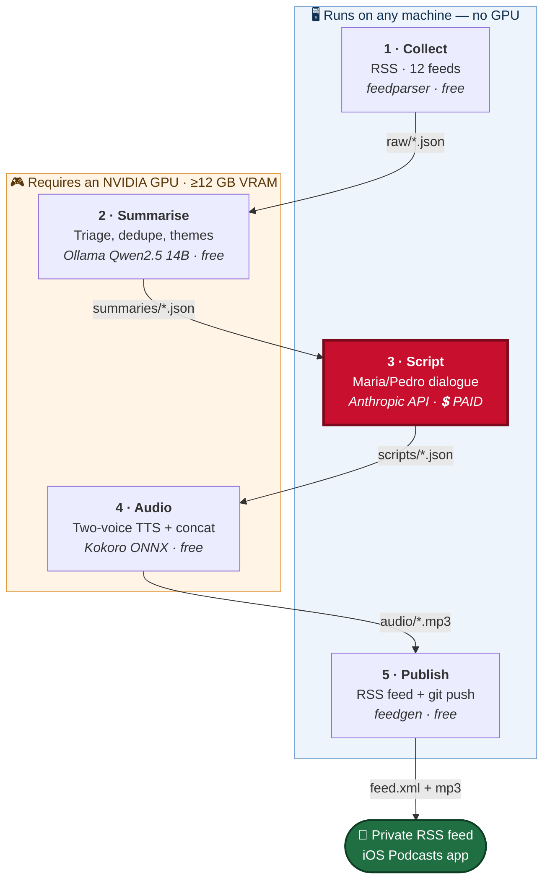

# News Radio

[](https://github.com/JoaoCarlos134/News_radio/actions/workflows/tests.yml)
[](LICENSE)


**An automated pipeline that turns each day's economy and geopolitics headlines into a two-voice podcast episode — collected, analysed, narrated and published without a human in the loop.** It runs overnight on a home PC and drops a finished ~19-minute episode into a private RSS feed before breakfast.

### What makes it interesting

Every stage that touches the outside world — the network, a local LLM, the paid API, the TTS engine, the git push — takes its client as an injected parameter. That one constraint is why the **full 221-test suite runs in under a second with no GPU, no API key and no network access** — the same code that drives the real pipeline on an RTX 4070 — and why a stranger can clone the repo and watch it produce a real RSS feed in one command. Cost is engineered rather than hoped for: summarisation and text-to-speech run on local models so the only metered call in the whole system is a single script-writing request, and the per-episode economics are **measured from real runs, not estimated** — 4,145 input and 10,141 output tokens, R$27/month against a R$50 budget. The speech-rate constant that sizes each episode was calibrated the same way: 172 words/minute, derived from a complete 18.74-minute episode rather than a short sample, because shorter samples read 15% fast and blew the duration ceiling.

The project also documents what it *rejected*. Claude Haiku 4.5 costs a sixth as much and was tested and turned down for inventing arithmetic; the narrator's voice is `ef_dora` from Kokoro's Spanish pack rather than the Brazilian `pf_dora`, chosen by listening to six variants side by side. Both decisions are recorded with their reasoning, in [Cost](#cost) and [Voice selection](#voice-selection).

### Hear it

▶️ **[27-second sample — the two synthesised voices, Maria and Pedro](docs/sample-voice.mp3)**
*(327 KB, generated locally by Kokoro — click to play in GitHub's audio viewer.)*

🎧 **[The six voice candidates that decided Maria's voice](docs/voices/)** — the
listening test behind the `ef_dora` choice, described in [Voice selection](#voice-selection).

### Run it yourself, in about thirty seconds

No API key, no GPU, no model downloads, no network:

```bash
git clone https://github.com/JoaoCarlos134/News_radio.git && cd News_radio
pip install -r requirements-dev.txt
python -m podcast.cli demo
```

`demo` runs the **real** pipeline code over committed fixtures and writes a genuine `feed.xml` you can subscribe to locally. It builds the actual stage 3 prompt and shows you the word budget it computes without sending it, plans the real stage 4 TTS segmentation without synthesising, and generates the feed through stage 5's real code path with a no-op pusher. Only the three calls that cost money or need hardware are stubbed — everything else is the code that runs in production.

> **To run the pipeline for real** you need an NVIDIA GPU with ≥12 GB VRAM plus locally downloaded Ollama and Kokoro models (stages 2 and 4), and your own paid Anthropic API key (stage 3). See [Setup](#setup).

---

## Architecture



**The single red box is the only thing that costs money.** Everything else is local or free — which is precisely what makes a two-voice format affordable, since doubling the TTS volume doubles a cost of zero.

Each stage reads the previous stage's JSON from `data/` and writes its own, so any stage can be run and inspected in isolation.

| # | Stage | Where it runs | Cost | Status |
|---|-------|---------------|------|--------|
| 1 | RSS collection | any machine | R$0 | **implemented** |
| 2 | Summarise / triage (Ollama) | **needs GPU** | R$0 | **implemented** |
| 3 | Script synthesis (paid API) | any machine | ~R$0.90/day | **implemented** |
| 4 | Audio (Kokoro TTS) | **needs GPU + models** | R$0 | **implemented** |
| 5 | Feed publication | any machine | R$0 | **implemented** |

### Why the dependency injection matters

Stage 1 takes a `fetcher`, stages 2 and 3 take a `client`, stage 4 takes an `engine`, stage 5 takes a `pusher`. Each defaults to the real implementation and is overridden in tests. The payoff is concrete: **no test touches the network, spends a cent of API credit, or requires a GPU.** That is what lets CI verify the whole pipeline on a bare Linux runner with no GPU and no secrets, and what makes `demo` possible at all — it swaps the three external calls for fixtures and still runs every other line of real code. Tests needing the optional audio stack degrade via `pytest.importorskip` rather than failing.

A separate test, `TestSemCaminhosAbsolutosNoCodigo`, fails the build if any absolute machine path (`C:\Users`, `/home/`, `/Users/`, `OneDrive`) appears in the package — enforcing that a fresh clone works without editing code.

---

## Cost

The project budget is R$50/month. Only stage 3 costs anything.
(token costs as of august 2026)

| Model (`SCRIPT_MODEL`) | Per day | Per month | Note |
|---|---|---|---|
| `claude-sonnet-5` | US$0.165 | **~R$27** | **default** — best analysis |
| `claude-haiku-4-5` | US$0.023 | ~R$4 | tested and rejected, see below |

**Measured, not estimated:** a real episode (4 Aug 2026) consumed 4,145 input and 10,141 output tokens on Sonnet — adaptive thinking is billed as output and accounts for much of that. Converted at R$5.50/US$; *check the exchange rate before treating this as firm.*

> **Haiku costs a sixth as much and isn't worth it.** On the same digest it invented a false arithmetic equivalence ("one point eight percent of a month = two days of work"; it's half a day), varied between 1,753 and 2,614 words across identical runs, and slipped grammatically. In a programme whose entire purpose is explaining economics, a fabricated number is the one defect that can't be accepted. It stays as plan B if the budget tightens.

> **Don't switch to `claude-opus-5`** without redoing the maths: at US$5/US$25 the episode exceeds R$60/month and breaks the budget.

Change `SCRIPT_MODEL` in `.env` to switch.

---

## Setup

This runs on one machine: an **NVIDIA GPU with at least 12 GB VRAM** for stages 2 and 4, plus a paid Anthropic API key for stage 3. Follow in order.

> **Only want to run the tests, the demo, or stage 1?** `pip install -r requirements-dev.txt` is enough — no GPU, no key, no model downloads, nothing to configure. That is exactly what CI installs. From such an install you can also exercise the paid stage 3 alone with `script --from-raw data/raw/YYYY-MM-DD.json`, which skips stage 2's triage — handy for testing the API call, but not the production path, since script quality drops without triage.

### 1. Repository and dependencies

> **Use Python 3.13.** `kokoro-onnx` (stage 4) still declares `Requires-Python >=3.10,<3.14`, so on a 3.14 venv `pip install -r requirements.txt` fails at `kokoro-onnx`. Stages 1, 2, 3 and 5 work on 3.14; stage 4 does not.
>
> On 3.13, `pydub` also needs the `audioop-lts` backport — the `audioop` module left the stdlib in 3.13 (PEP 594). It's already in `requirements-audio.txt` with a version marker, so `pip install` resolves it automatically; just don't be surprised by the extra dependency.

```bash
git clone https://github.com/JoaoCarlos134/News_radio.git && cd News_radio
cd News_radio
py -3.13 -m venv .venv
.venv\Scripts\activate
pip install -r requirements.txt -r requirements-dev.txt
```

### 2. ffmpeg (required to export mp3)

`pydub` needs ffmpeg on PATH. On Windows, with winget:

```bash
winget install Gyan.FFmpeg
ffmpeg -version   # open a new terminal after installing
```

### 3. Ollama + local model (stage 2)

Install Ollama from <https://ollama.com/download>, then pull the model. Qwen 2.5 14B and Llama 3.1 8B both fit in the 4070's 12 GB:

```bash
ollama pull qwen2.5:14b-instruct-q4_K_M
ollama list   # confirm the service responds
```

If you choose another model, set `OLLAMA_MODEL` in `.env`.

### 4. Kokoro TTS (stage 4)

Download both model files into `models/` at the repo root (it's gitignored — the files never reach git):

- `kokoro-v1.0.onnx`
- `voices-v1.0.bin`

Both are in the project's releases: <https://github.com/thewh1teagle/kokoro-onnx/releases>

#### Voice selection

Kokoro v1.0's Brazilian Portuguese voices are `pf_dora` (female), `pm_alex` and `pm_santa` (male), configured via `KOKORO_VOICE_MARIA` and `KOKORO_VOICE_PEDRO`.

**Maria uses `ef_dora`, not `pf_dora`.** It's the same voice actor from Kokoro's Spanish pack with a better-trained style vector; because phonemisation stays `pt-br`, Brazilian terms still come out correctly and the timbre is noticeably better. This was decided by listening to six variants side by side — **don't change it without repeating that test.** All six are in [`docs/voices/`](docs/voices/):

| Clip | Voice | Verdict |
|---|---|---|
| [1](docs/voices/1-pf_dora-ptbr.mp3) | `pf_dora` (pt-BR) | the obvious default — sounds artificial |
| [2](docs/voices/2-pf_dora-ptbr-slower.mp3) | `pf_dora` slowed | slowing it doesn't fix the timbre |
| [3](docs/voices/3-af_heart-english.mp3) | `af_heart` (en) | better voice, wrong language phonemes |
| [4](docs/voices/4-af_bella-english.mp3) | `af_bella` (en) | same problem |
| [5](docs/voices/5-ef_dora-spanish-CHOSEN.mp3) | `ef_dora` (es) | **chosen** — same actor, better style vector |
| [6](docs/voices/6-blend-dora-heart.mp3) | blend of 1 + 3 | blending degrades both |

English voices were also trialled and rejected: they're better voices, but they mispronounce exactly the proper nouns that dominate the programme (Ibovespa, Selic, Copom, Petrobras). Trading synthetic timbre for a wrong pronunciation in every sentence isn't a good deal.

### 5. Paid API key (stage 3)

Create a key at <https://console.anthropic.com/settings/keys> and put it in `.env`.

### 6. Publication — GitHub Pages (stage 5)

`data/public/` holds the published `feed.xml` and mp3s, and must already be a git checkout of a `gh-pages` branch. Stage 5 only does `git add/commit/push` on it — it never creates the branch itself, since that's one-time manual configuration, not something to run blind at 5 a.m.

> 🔒 **Host the feed from a separate repository with a non-obvious name.**
> The feed's only protection is that its URL is hard to guess. If it's served from `gh-pages` on *this* public repo, the URL is `https://<your-user>.github.io/News_radio/feed.xml` — trivially derivable by anyone who can read this page, which defeats the entire privacy model. Publish to a separate, privately-named repo and keep that name out of this one. Set `PODCAST_BASE_URL` in `.env` (which is gitignored) and never hardcode it in tracked files.

Set up the publish target as a *worktree*, so `data/public/` is a normal git checkout of the pages branch while the rest of the repo stays on `main`:

```bash
git worktree add --orphan -b gh-pages data/public
git -C data/public commit --allow-empty -m "Initial GitHub Pages branch"
git -C data/public push -u <your-private-feed-remote> gh-pages
```

Then enable **Settings → Pages → Source → Deploy from a branch → `gh-pages`** on the hosting repo.

The feed keeps the most recent `MAX_EPISODES_IN_FEED` (30) episodes and deletes older mp3s, so the published repo stays small.

### 7. Configuration

```bash
cp .env.example .env
```

Edit `.env` — `.env.example` documents every variable. The minimum:

| Variable | For |
|---|---|
| `ANTHROPIC_API_KEY` | stage 3 — paid API key |
| `OLLAMA_MODEL` | stage 2 — only if using a non-default model |
| `PODCAST_BASE_URL` | stage 5 — the Pages URL configured in step 6 |
| `PODCAST_AUTHOR`, `PODCAST_EMAIL` | stage 5 — feed metadata |

The Kokoro paths already point at `./models/` and resolve from the repo root — **don't use absolute paths** in `.env`.

### 8. Verify everything at once

```bash
python -m podcast.cli doctor
```

This runs no stage; it only reports what's still missing or unconfigured, stage by stage. Run it until everything shows `[ok]`.

---

## Usage

```bash
python -m podcast.cli doctor          # diagnose the environment
python -m podcast.cli sources         # list RSS sources
python -m podcast.cli sources --check # test which feeds respond right now

python -m podcast.cli collect         # stage 1
python -m podcast.cli summarize       # stage 2  (needs GPU)
python -m podcast.cli script          # stage 3  (needs API key)
python -m podcast.cli audio           # stage 4  (needs Kokoro)
python -m podcast.cli publish         # stage 5

python -m podcast.cli run             # all five in order — this is what the scheduler calls

python -m podcast.cli demo            # the whole thing over fixtures; no key, GPU or network
```

Useful flags: `collect --dry-run` (print without saving or marking as seen), `script --from-raw FILE` (skip stage 2), `script --show` (print the generated script), `-v` (verbose logging).

### Scheduling (overnight)

On Windows, point Task Scheduler at the venv's Python:

```
Program:    <repo path>\.venv\Scripts\python.exe
Arguments:  -m podcast.cli run
Start in:   <repo path>
```

Set it to run daily around 5 a.m. with "Run whether user is logged on or not". **"Start in" is mandatory** — without it the relative paths in `.env` don't resolve.

---

## Project layout

```
podcast/
  config.py            configuration from .env; resolves paths from the repo root
  models.py            dataclasses passed between stages (+ JSON serialisation)
  sources.py           RSS source registry
  textutils.py         HTML cleanup, URL canonicalisation, title similarity
  stage1_collect.py    stage 1 — injected `fetcher`
  stage2_summarize.py  stage 2 — injected `client`
  stage3_script.py     stage 3 — injected `client`
  stage4_audio.py      stage 4 — injected `engine`
  stage5_publish.py    stage 5 — injected `pusher`
  cli.py               command-line interface

tests/                 221 tests; no network, no API key, no GPU required
demo/                  fixtures for `podcast demo` — real stage 2 and 3 output, trimmed
.github/workflows/     CI — runs the suite on Python 3.11, 3.12 and 3.13
docs/sample-voice.mp3  the audio sample linked at the top of this README
docs/voices/           the six candidates from the voice listening test
data/                  pipeline output (gitignored)
data/public/           published mp3 + feed.xml — a git checkout of the pages branch
models/                Kokoro model files (gitignored)
```

---

## Content and usage notes

- **Copyright.** The pipeline consumes only the headlines and short summaries the feeds themselves publish, and synthesises in its own words. This is enforced two ways, one mechanical and one instructional. Stage 1 *structurally* cannot reproduce article text: it caps each summary at 600 characters, deliberately reads the feed's `summary` field rather than `content` (which often carries the full article), and never fetches the article page at all — there is no scraper in this codebase. Stage 3 reinforces it in the system prompt, which mandates synthesis in the model's own words and forbids reproducing source phrasing verbatim. The stage 1 guarantee is the strong one; the stage 3 rule is a prompt instruction, not a post-generation check.
- **Personal use.** Brazilian outlets' RSS feeds are free but generally licensed for personal, non-commercial use without modifying the content. This project is built for exactly that: a private feed, unlisted, not republished. Premium wires (Reuters, Bloomberg, FT) are deliberately excluded — their terms don't permit automated use. **If the feed ever became genuinely public, this assessment would need redoing.**
- **The feed is private only by URL obscurity** — anyone with the link can listen. Don't submit it to podcast directories, and see the hosting note in step 6.
- **Human review.** Light periodic review, not per-episode: listen to a few episodes a week and adjust the stage 3 prompt.

---

## License

MIT — see [LICENSE](LICENSE).

The licence covers this source code only. It does not license the news content
the pipeline reads, the Kokoro model weights (Apache 2.0, distributed
separately), or any generated episode.

---

## Development

```bash
python -m pytest              # everything
python -m pytest -v           # verbose
python -m pytest tests/test_stage1_collect.py
```

Every stage that talks to an external service (network, Ollama, paid API, git) receives its client by injection so the tests run without that service. Follow that pattern in any new stage — it's what keeps the suite runnable on CI and from a fresh clone.

### A note on language

The package is written in English. Some things are deliberately in Portuguese, and each is marked in place: the stage 2 and 3 prompts, which instruct models that must answer in Portuguese; the strings that reach the feed and the mp3's ID3 tags, which listeners read in their podcast app; and the stopword list and boilerplate patterns, which are matched against Portuguese text.

`tests/` is in Portuguese too. Its fixtures are real Brazilian feeds and its names describe behaviour over Portuguese text — `test_remove_titulo_semelhante_de_veiculos_diferentes` says what it checks more precisely than an English rename would. That is a decision, not an oversight.

Architecture decisions and project constraints are recorded in [CLAUDE.md](CLAUDE.md).
